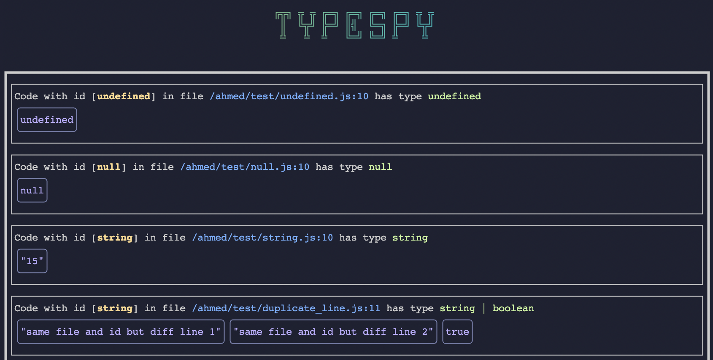

# typespy 🕵🏻‍♂️ [beta]

Do you love typescript but hate those `any`s and `unknown`s ?

too lazy to add console logs all over the place to see runtime values?

typespy is a webserver and a babel plugin to make tracking runtime values as easy as adding a single comment.



### Installation

- `npm install typespy`
- add a new command in your package.json file to run the server `"typespy": "typespy"`
- add this plugin to your babel config `'./node_modules/typespy/dist/babel/plugin.js'`. Make sure to include it only in dev mode!
- Add this code as early to your app

  ```typescript
  import { typespyFactory } from 'typespy';

  // or however you check for dev mode!
  if (__DEV__) {
    window[DEFAULT_FN_NAME] = typespyFactory();
  }
  ```

- thats it! commit those changes to be ready anytime 🎉

### Usage

- run the typespy sever `npm run typespy`
- if you want to know the value of any expression like `someVariable` or `this.props`
  - add a spy comment like this one where you want to check the value: `// spy someVariable`
  - run your app and try to trigger hit the commented line
  - all the values and suggested type will be shown in the typespy server
- everytime a spy comment gets executed you will be notified with a notification and the server UI will update

### Changing defaults

```typescript
import { typespyFactory } from 'typespy';

// or however you check for dev mode!
if (__DEV__) {
  // default is localhost, use this ip to access localhost from the android emulator for example
  const host = '10.0.2.2';
  // default is 4444
  const port = 1234;

  window[DEFAULT_FN_NAME] = typespyFactory(host, port);
}
```

Then you have to define your typespy npm task like this ` "typespy": "TYPESPY_PORT_NUM=1234 typespy"`

You must also pass the same options to the babel plugin like this

- `global`: defaults to window, change it if you want to attach the global function somewhere else
- `magicWord`: defaults to `spy`, change it if you prefer another comment keyword
- `fnName`: defaults to `_typespy_`

```json
{
  "plugins": [
    [
      "./node_modules/typespy/dist/babel/plugin.js",
      { "global": "globalThis", "magicWord": "wth_is", "fnName": "CIA_SPY" }
    ]
  ]
}
```

then you will need this changes as well

```typescript
globalThis['CIA_SPY'] = typespyFactory(host, port);
```

and then your spy comments should look like this

```js
// wth_is props
```
